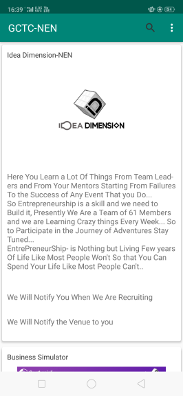
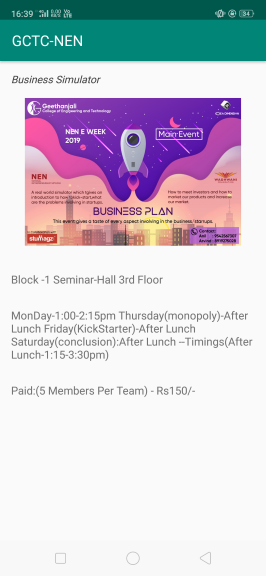

# IdeaDimension

This is created by me For nen E week
And this App Gives Information About the Events Going on in Nen-E week
and Features are LightWeight.. 
1 :Search bar is present where you Can search for Events Going on in College... 
2 :light weight and fast ... 
3 :Has a login page for authentication... 

# Screen Shot from the Application ..
Event preview  
 

Event information 
 

1 : used recycler view to load the data as we scroll down...  
2 : used sqllite database for light usage adn it is deployed in your own mobile only.. for authentication...  
3 : used adapter class for the recycler view ..  
4 : it uses mvc type appproach to pull the data and present on the screen ...  
5 : hardcoded the data ih the object of the adapter class data to be passed on but should populate the data using the database 
as it is the best practise..  
6 : used the authetication of the inbuilt methods for chechking of the strings which it takes from the user as input ...  
7 : only takes input of the username as email only but not as any other format...  
8 : finally it is the basic one having used multiple concepts but i would likke to add more functionality in future...like using firebase,notifications,etc...  

